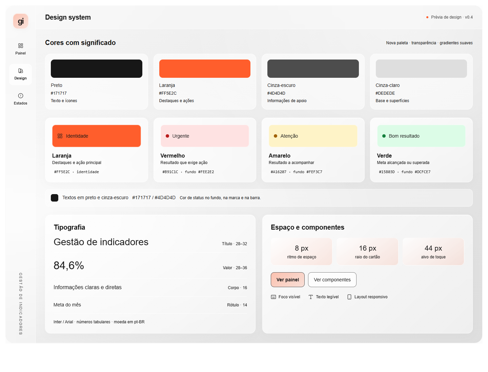
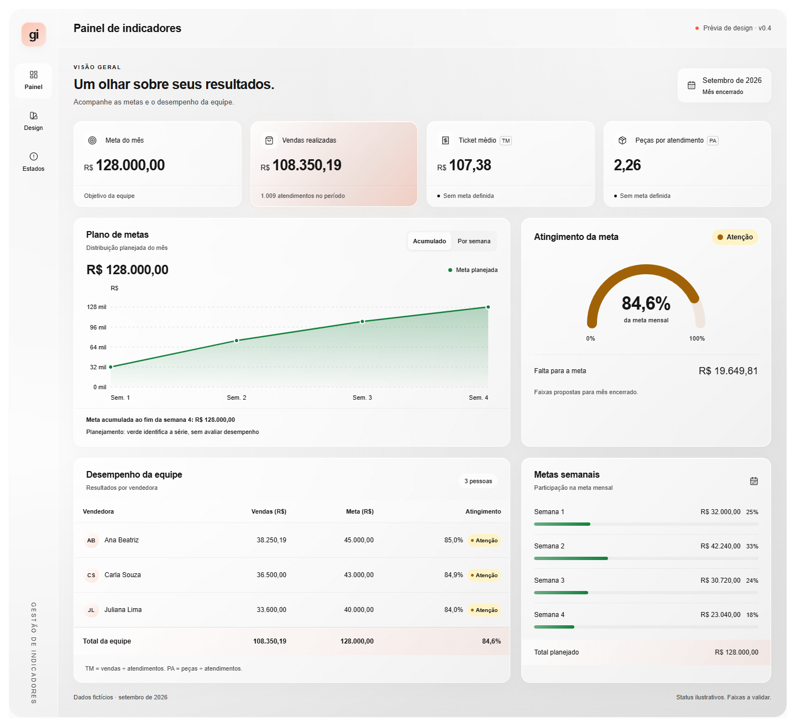

# Gestão de indicadores

Painel de vendas, metas e desempenho da equipe.

## Etapa atual: design

[Abrir protótipo publicado](https://gestao-indicadores-design-system.d-d-cosm-tic-7623.chatgpt.site) — v0.4, com navegação compacta, gráfico de metas e medidor semicircular. Acesso privado preservado.

- [Design system](design/DESIGN_SYSTEM.md): cores, tipografia, componentes, responsividade, acessibilidade e regras propostas de status.
- [Protótipo de revisão](design/prototipo.html): abrir o arquivo no navegador para navegar por Fundamentos, Painel e Estados. O GitHub exibe o código do documento; baixe-o para visualizar.

Nova paleta: #171717, #FF5E2C, #4D4D4D e #DEDEDE. Cartões translúcidos, fundo claro e gradientes suaves. Vermelho para urgência, amarelo para atenção e verde para bons resultados.

Os dados são fictícios. As faixas de status ainda precisam ser validadas. A implementação da aplicação será uma etapa posterior.

## Prévia

Laranja reservado a destaques e ações. Gráficos usam vermelho, amarelo e verde; o planejamento é identificado explicitamente.
