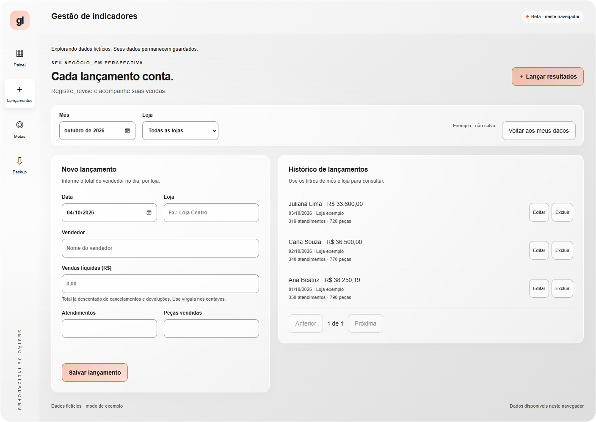

# Gestão de indicadores

[Abrir painel beta](https://washingtonolv.github.io/gestao-de-indicadores/)

Beta com lançamentos manuais, metas por loja e mês, indicadores calculados, histórico editável, backup e restauração. Os dados ficam no navegador; não há banco no servidor ou sincronização entre dispositivos. Acesso privado do Sites preservado.

- [Guia da beta e limitações](beta/README.md)
- [Estrutura do banco e regras de acesso](supabase/README.md)
- [Documento navegável](design/prototipo.html)
- [Especificação visual anterior](design/DESIGN_SYSTEM.md)

Paleta neutra e cards translúcidos. #FF5E2C para destaques; #FF0000, #FFE100 e #00FF00 para resultados de meses encerrados. Movimento suave, detalhes por mouse/toque/teclado e respeito a movimento reduzido.

